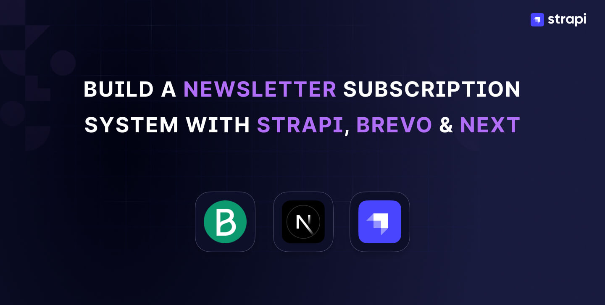
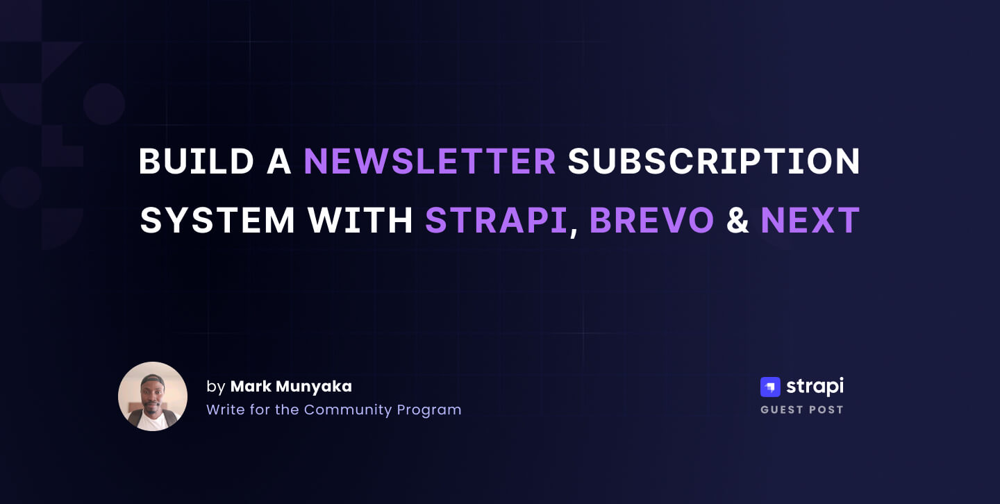

# Build a Newsletter Subscription System with Strapi, Brevo & Next.js



## Description

This repository contains the source code for the article: [How to Set Up a Newsletter Subscription Service with Strapi, Brevo, and Next.js](
), written for [Strapi's Blog](https://strapi.io/blog).

## Prerequisites

To test out the source code you will need the following:
- [Node.js LTS v18 or v20 or v22](https://nodejs.org)
- [Brevo account](https://onboarding.brevo.com/account/register)

## Getting Started

Clone the repository.
```bash
git clone https://github.com/Marktawa/newsletter
```

## Strapi Setup

### Installation

Install dependencies
```bash
cd newsletter/newsletter
```

Set up Environment variables.
```bash
cp .env.example .env
```

Create admin user with email `chef@strapi.io` and password `Gourmet1234`.
```bash
npm run strapi admin:create-user -- --firstname=Kai --lastname=Doe --email=chef@strapi.io --password=Gourmet1234
```

Run Strapi server.
```bash
npm run develop
```

Login to your Strapi admin by visiting [localhost:1337/admin](http://localhost:1337/admin) using the admin email and password you created earlier.


Clicking on **Login** gives you the Strapi Admin Dashboard Home page:


### Configure Brevo

[Sign in to your Brevo account](https://login.brevo.com), and generate a new API key in the [API keys page](https://app.brevo.com/settings/keys/api).


Add your Brevo API key to your environment variables by updating the `.env` file.

```
BREVO_API_KEY=Your-newly-generated-Brevo-API-key
```

### Generate API Token

Click **Settings** then **API Tokens** in your Strapi Admin Panel.

Click **Create new API Token**.

Configure the token as follows:
- **Name:** `Next.js Frontend`
- **Description:** `Token for newsletter subscription form`
- **Token type:** `Custom`
- **Duration:** Set preferred duration


Under **Permissions** enable the `create` option for the **Subscriber** collection.


Click **Save**, and copy the generated token (store it securely).


## Next.js Setup

Open up your project folder, `newsletter` in a new terminal session.

### Installation

Install dependencies.
```bash
cd newsletter/frontend
```

```bash
npm install
```

### Environment Variables

Set up Environment variables.
```bash
cp .env.example .env
```

Add API Token to environment variables
```
STRAPI_API_TOKEN=your-strapi-api-token
```

## Test out code

Run the following command inside the Next.js folder, `newsletter/frontend` to launch the app.
```bash
npm run dev
```

Visit [localhost:3000](http://localhost:3000/) to view the Newsletter Sign up landing page.


## Author



Mark Munyaka  
[dev.to/markmunyaka](https://dev.to/markmunyaka)

